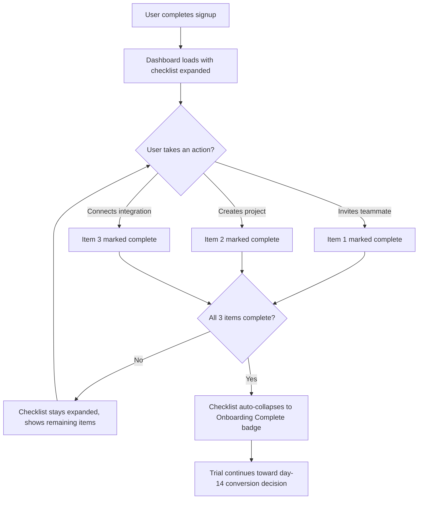

# Product Requirements: Trial Onboarding Checklist

A business analysis artifact — epic breakdown, user stories with acceptance
criteria, and a process flow diagram — for the same feature validated by
the A/B test in this repo: a Quick-Start Checklist shown to new users
during a SaaS product's free trial.

This document represents the requirements-definition step that would happen
*before* that A/B test: a BA scoping what the feature actually needs to do,
before an engineering team builds it and a data team measures it.

## Epic

**Quick-Start Checklist for New Trial Users**

New trial users currently land on an empty dashboard with no guidance on
what to do first. This epic covers a checklist shown immediately after
signup that nudges users toward the three actions that most strongly
correlate with activation: inviting a teammate, creating a project, and
connecting an integration.

## Backlog

| ID | User Story | Priority (MoSCoW) | Story Points |
|---|---|---|---|
| US-1 | New user sees the checklist on first login | Must | 3 |
| US-2 | User checks off a completed action | Must | 2 |
| US-3 | Checklist auto-dismisses once all items are complete | Must | 2 |
| US-4 | User can manually collapse/reopen the checklist | Should | 2 |
| US-5 | Checklist re-appears on next login if not yet complete | Should | 3 |
| US-6 | Product team can see checklist completion rate per user | Could | 5 |

## User Stories & Acceptance Criteria

### US-1: New user sees the checklist on first login

**As a** new trial user
**I want to** see a checklist immediately after I sign up
**So that** I know exactly what to do first instead of guessing

**Acceptance Criteria:**
- Given a user has just completed signup, when they land on the dashboard for the first time, then the checklist widget is visible without needing to be opened manually.
- Given the checklist is visible, when it renders, then it shows exactly 3 items: "Invite a teammate," "Create a project," "Connect an integration."
- Given a returning user has already completed all 3 items, when they log in, then the checklist does not appear (see US-3).

### US-2: User checks off a completed action

**As a** trial user
**I want to** see an item automatically marked complete when I do it
**So that** I know my progress is being tracked without extra effort

**Acceptance Criteria:**
- Given a user completes one of the 3 tracked actions (e.g. invites a teammate), when that action succeeds, then the corresponding checklist item is marked complete within 5 seconds, without requiring a page refresh.
- Given an item is marked complete, when the user views the checklist again, then that item shows a checkmark and cannot be un-checked manually.

### US-3: Checklist auto-dismisses once all items are complete

**As a** trial user who has finished onboarding
**I want to** have the checklist get out of my way once I'm done
**So that** it doesn't clutter my dashboard after it's served its purpose

**Acceptance Criteria:**
- Given all 3 checklist items are marked complete, when the user next loads the dashboard, then the checklist widget is collapsed to a small "Onboarding complete" badge instead of the full checklist.
- Given the checklist has auto-dismissed, when the user clicks the badge, then they can still expand it to see what they completed (no data is lost).

### US-4: User can manually collapse/reopen the checklist

**As a** trial user
**I want to** be able to minimize the checklist myself
**So that** it doesn't block my screen if I want to focus on something else

**Acceptance Criteria:**
- Given the checklist is expanded, when the user clicks the collapse icon, then it shrinks to a small tab in the corner of the dashboard.
- Given the checklist is collapsed, when the user clicks that tab, then it re-expands to full size.
- Given a user collapses the checklist, when they log in again later (same session or a new one), then it returns to its default (expanded) state — collapsing is not persisted, so it doesn't get lost/forgotten.

### US-5: Checklist re-appears on next login if not yet complete

**As a** trial user who hasn't finished onboarding
**I want to** be reminded of what's left to do
**So that** I don't forget about the product's key features before my trial ends

**Acceptance Criteria:**
- Given a user has completed 0, 1, or 2 of the 3 items, when they log in on a later day, then the checklist appears expanded by default, showing only the remaining incomplete items highlighted.
- Given a user is on the last day of their trial with incomplete items, when they log in, then the checklist includes a visible reminder of how many days are left.

### US-6: Product team can see checklist completion rate per user

**As a** product manager
**I want to** see what percentage of trial users complete each checklist item
**So that** I can tell which activation action is the biggest drop-off point

**Acceptance Criteria:**
- Given checklist interaction data is being logged, when a PM opens the internal analytics dashboard, then they can see completion rate broken out by each of the 3 items individually, not just an overall completion rate.
- Given the data is segmented, when a PM filters by signup date range, then the completion rates recalculate for only that cohort.

## Process Flow

## Honest limitations

- This is a documentation artifact, not a working product — there's no
  actual application behind these user stories.
- Story points are illustrative estimates, not derived from a real team's
  velocity or planning session.
- A real BA artifact would typically also include non-functional
  requirements (performance, accessibility) and a RACI or stakeholder map;
  both are omitted here to keep the artifact focused on the core
  requirements-definition skill (user stories, acceptance criteria, and
  process flow).